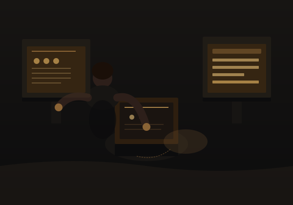

### Architecting scalable web applications with clean code, strong design, and real-world impact.

  
  
  

---

## 🚀 About Me

<table style="width:100%; border: none; background: transparent;">
<tr style="border: none;">
<td style="border: none; padding-right: 20px; vertical-align: top; width: 60%;">

I'm **Girish Masade**, a Full Stack Developer crafting production-grade applications from Mumbai with meticulous attention to quality and user experience.

**Core Expertise:**
- **Frontend Engineering** — High-performance React interfaces with strong UX principles
- **Backend Architecture** — Scalable REST APIs, microservices, and real-time systems  
- **Security & Auth** — JWT-based authentication, authorization, and secure data flows
- **System Design** — Caching strategies, database optimization, and performance engineering
- **Product Mindset** — Building for users, not just shipping features

I believe in writing code that's not just functional, but maintainable, performant, and a pleasure to work with.

</td>
<td style="border: none; vertical-align: top; width: 40%; display: flex; align-items: center; justify-content: center;">

</td>
</tr>
</table>

---

## 🎯 Current Focus

<table style="width: 100%; border: none; background: transparent;">
<tr style="border: none;">
<td style="border: 1px solid #8A6335; border-radius: 8px; padding: 20px; background: rgba(138, 99, 53, 0.05); margin: 8px;">

**Full Stack Development**

Production MERN applications with focus on scalability and maintainability

</td>
<td style="border: 1px solid #8A6335; border-radius: 8px; padding: 20px; background: rgba(138, 99, 53, 0.05); margin: 8px;">

**AI Engineering**

LLM-powered workflows and intelligent system design

</td>
<td style="border: 1px solid #8A6335; border-radius: 8px; padding: 20px; background: rgba(138, 99, 53, 0.05); margin: 8px;">

**System Architecture**

Distributed systems, API design, and performance optimization

</td>
</tr>
</table>

---

## 🛠️ Technology Arsenal

<h4>Frontend Ecosystem</h4>

<h4 style="margin-top: 20px;">Backend & Infrastructure</h4>

<h4 style="margin-top: 20px;">Data & Persistence</h4>

<h4 style="margin-top: 20px;">Tools & Platforms</h4>

---

## 💼 Featured Projects

<table style="width: 100%; border-collapse: collapse; background: transparent;">
<tr style="border: none;">
<td style="width: 48%; border: none; padding: 12px; margin-bottom: 20px;">

#### 💰 Personal Finance Tracking
**Full-stack MERN application** for comprehensive financial management

**Features:**
- 📊 Income & expense categorization
- 🎯 Budget goals with real-time tracking
- 📈 Interactive financial visualizations
- 📱 Responsive analytics dashboard

**Stack:** React | Node.js | MongoDB | Chart.js

</td>
<td style="width: 48%; border: none; padding: 12px; margin-bottom: 20px;">

#### ✅ Task Management System
**Productivity platform** for team collaboration and workflow

**Features:**
- 📋 Create, assign & prioritize tasks
- 🔄 Status-based workflow automation
- ⚡ Real-time updates
- 👥 Team collaboration features

**Stack:** React | Express | MongoDB | Socket.io

</td>
</tr>

<tr style="border: none;">
<td style="width: 48%; border: none; padding: 12px; margin-bottom: 20px;">

#### 💪 Fitness Discovery App
**Modern platform** for exercise discovery and fitness tracking

**Features:**
- 🔍 Search & discover exercises
- 🏋️ Filter by muscle group & difficulty
- 📂 Category-based organization
- 📱 Mobile-first responsive design

**Stack:** React | Tailwind CSS | REST API

</td>
<td style="width: 48%; border: none; padding: 12px; margin-bottom: 20px;">

#### 📝 MERN Blog Platform
**Full-featured blogging engine** with content management

**Features:**
- 🔐 JWT-based authentication
- ✍️ Create, edit & delete posts
- 💬 Comment system
- 👤 User profiles & following

**Stack:** React | Express | MongoDB | JWT

</td>
</tr>

<tr style="border: none;">
<td style="width: 48%; border: none; padding: 12px; margin-bottom: 20px;">

#### 🎵 Music Learning Platform
**Curated learning experience** for modern music education

**Features:**
- 📚 Course discovery & browsing
- 🎯 Responsive navigation
- ✨ Animated interactions
- 📖 Clean content hierarchy

**Stack:** Next.js | React | Tailwind CSS

</td>
<td style="width: 48%; border: none; padding: 12px; margin-bottom: 20px;">

#### 🔐 Auth Foundation Suite
**Production-ready authentication system** for secure applications

**Features:**
- 📝 User registration & login
- 🔑 JWT session management
- 🛡️ Protected route guards
- 👑 Role-based access control

**Stack:** Next.js | Node.js | MongoDB | JWT

</td>
</tr>
</table>

---

## 💡 Engineering Philosophy

<table style="width: 100%; border-collapse: collapse; border: none;">
<tr style="border: none;">
<td style="border: 1px solid #8A6335; border-radius: 8px; padding: 16px; background: rgba(138, 99, 53, 0.08); margin: 6px; width: 48%;">

**1️⃣ Problem-First Approach**

Solve the problem BEFORE optimizing the code

</td>
<td style="border: 1px solid #8A6335; border-radius: 8px; padding: 16px; background: rgba(138, 99, 53, 0.08); margin: 6px; width: 48%;">

**2️⃣ Code Clarity**

Keep components small and reason-able

</td>
</tr>
<tr style="border: none;">
<td style="border: 1px solid #8A6335; border-radius: 8px; padding: 16px; background: rgba(138, 99, 53, 0.08); margin: 6px; width: 48%;">

**3️⃣ Security as Foundation**

Treat auth & validation as core concerns, not afterthoughts

</td>
<td style="border: 1px solid #8A6335; border-radius: 8px; padding: 16px; background: rgba(138, 99, 53, 0.08); margin: 6px; width: 48%;">

**4️⃣ Deliberate Caching**

Cache strategically — not everywhere

</td>
</tr>
<tr style="border: none;">
<td style="border: 1px solid #8A6335; border-radius: 8px; padding: 16px; background: rgba(138, 99, 53, 0.08); margin: 6px; width: 48%;">

**5️⃣ Metrics-Driven**

Optimize based on data, not hunches

</td>
<td style="border: 1px solid #8A6335; border-radius: 8px; padding: 16px; background: rgba(138, 99, 53, 0.08); margin: 6px; width: 48%;">

**6️⃣ Multi-Audience Code**

Build for users, APIs for systems, code for maintainers

</td>
</tr>
</table>

---

## 📊 GitHub Analytics

---

## 🤝 Let's Build Together

I'm actively seeking opportunities in:

<table style="width: 100%; border: none; background: transparent;">
<tr style="border: none;">
<td style="border: 1px solid #8A6335; border-radius: 8px; padding: 16px; background: rgba(138, 99, 53, 0.08); width: 30%; margin: 8px;">

**💼 Freelance & Contract Work**

Full-stack development with flexible engagement models

</td>
<td style="border: 1px solid #8A6335; border-radius: 8px; padding: 16px; background: rgba(138, 99, 53, 0.08); width: 30%; margin: 8px;">

**🚀 Startup Collaboration**

Ambitious projects with high-impact potential

</td>
<td style="border: 1px solid #8A6335; border-radius: 8px; padding: 16px; background: rgba(138, 99, 53, 0.08); width: 30%; margin: 8px;">

**📚 Open Source & Mentorship**

Contributing to community and sharing knowledge

</td>
</tr>
</table>

---

## 📬 Connect With Me

> **"First, solve the problem. Then, write the code."**

*Always learning, always building. Last updated: August 2026*

